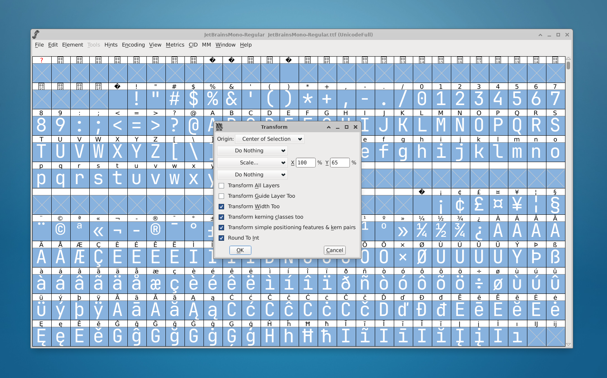

# project pequeño
Patches and tutorial on how to allow line spacing less than 1 in vte-based terminals

#### Final result


<br />
<br />
The year is 2024, the year of the Linux desktop. Linux is so mainstream now that developers care about the user experience by not allowing them to set line spacing to some crazy value like 0.1.  

<br />
<br />


##### My reaction:


But we all know that you want that Bisqwit-like terminal:<br />


[credit](https://www.youtube.com/@Bisqwit)
<br />

##### The plan

1.  Patch xfce4-terminal. Compile xfce4-terminal. Install xfce4-terminal.
2.  Patch vte. Compile vte. Install vte.
3.  Modify your favorite monospace font. Install font.

##### Environment

- Ubuntu 24.04 LTS
- XFCE 4.18
- X11

##### Clone repos

`git clone https://gitlab.xfce.org/apps/xfce4-terminal.git`\
`git clone https://gitlab.gnome.org/GNOME/vte.git`\
`git clone https://github.com/agiUnderground/project-pequeno.git`

xfce4-terminal HEAD - `08918c7be45771584c9e4ad6f80253d855cac1b5`\
vte HEAD - `4bb767c342c099cafffb760cd0e7a255a72e9578`

### Let's patch xfce4-terminal first

`cd xfce4-terminal`\
`git apply ~/project-pequeno/assets/patches/xfce4-terminal-patch.diff`

Check the changes:
`git diff`

Commit:

`git add .`\
`git commit -m "Allow decimal values for cell spacing."`

Here is what we're changing:

```c
GtkWidget*
gtk_spin_button_new_with_range (
  gdouble min,
  gdouble max,
  gdouble step
)
```

```c
GParamSpec*
g_param_spec_double (
  const gchar* name,
  const gchar* nick,
  const gchar* blurb,
  gdouble minimum,
  gdouble maximum,
  gdouble default_value,
  GParamFlags flags
)
```

You can check .diff file with the editor and apply changes manually if you want to.
For example you can change `step` value from `0.01` to `0.001` if you want.

##### Let's compile xfce4-terminal

`sudo apt install xfce4-dev-tools build-essential gtk-doc-tools autopoint`\
`sudo apt build-dep xfce4-terminal`\
`./autogen.sh`\
`make -j$(nproc)`\
`sudo make install`

Result of the successful build:


Nice.

Right now, changing the cell spacing value to a value less than 1 has no effect. We need to patch VTE.

### Let's patch vte

`cd ~/vte`\
`git apply ~/project-pequeno/assets/patches/vte-patch.diff`

Check the changes:

`git diff`

Commit:

`git add .`\
`git commit -m "Allow decimal values for cell spacing."`

Dependencies and compilation:

`sudo apt install meson cmake liblz4-dev libgtk-4-dev libsystemd-dev libgirepository1.0-dev valac`\
`meson _build`\
`ninja -C _build`\
`sudo ninja -C _build install`

Check out that you have fresh libs installed:

`ls -lah /usr/local/lib/x86_64-linux-gnu/libvte*`

Make sure that you terminal binary is linked with the new library:\
`ldd $(which xfce4-terminal) | grep vte`

We're literally half way there:


### Custom font

We need a custom font to make our new terminal somewhat usable.

First idea was to patch rendering engine(whatever it is in this case).\
But text rendering is really really complex topic, so I'm glad we can get what we need with a custom font.

I'll use `JetBrains Mono`. [link](https://www.jetbrains.com/lp/mono/)

`cd Downloads`\
`wget https://download.jetbrains.com/fonts/JetBrainsMono-2.304.zip`\
`unzip JetBrainsMono-2.304.zip -d jetbrains-mono`

Very nice tool to inspect the fonts is `ftinspect`, you can install it with `sudo apt install freetype2-demos`.\
But to modify the font we gonna use `FontForge`.\
`sudo apt install fontforge`

Start a fontforge and choose a font `jetbrains-mono/fonts/ttf/JetBrainsMono-Regular.ttf`.


Now we need to squash symbols vertically.

`Edit -> Select -> Select All`

`Element -> Transformations -> Transform`

`Scale -> Y value 65% (for example)`

Check `Roud To Int` checkbox, to avoid unnecessary errors.



`Element -> Font Info`

Modify `Fontname` and `Name For Humans`.\
Choose `PS UID` from left column, check `Use UniqueID` checkbox and set `UniqueID` field to some random number value.\
Choose `General` from left column, set `Em Size` to `1024`.\
In `Change UniqueID?` dialog choose `change`.

`File -> Generate Fonts...`\
Choose custom name and type `TrueType`.


Ignore `Errors detected` dialog and press `Generate` button.

Install a new font.\
In my case is:

`sudo cp JetBrainsMono-Regular-Pequeno.ttf /usr/share/fonts/truetype/`

Update fonts cache:

`fc-cache -vf`


Done.


Disclaimer:\
I'm pretty sure that there are a lot of errors. Do not use it anywhere in production.\
The main goal of this one evening endeavor was just to make it work.\
The VTE patch is most likely not fully correct. If you already fixed it, I'm open to PRs.

THE SOFTWARE IS PROVIDED "AS IS", WITHOUT WARRANTY OF ANY KIND, EXPRESS OR IMPLIED, INCLUDING BUT NOT LIMITED TO THE WARRANTIES OF MERCHANTABILITY, FITNESS FOR A PARTICULAR PURPOSE AND NONINFRINGEMENT. IN NO EVENT SHALL THE AUTHORS OR COPYRIGHT HOLDERS BE LIABLE FOR ANY CLAIM, DAMAGES OR OTHER LIABILITY, WHETHER IN AN ACTION OF CONTRACT, TORT OR OTHERWISE, ARISING FROM, OUT OF OR IN CONNECTION WITH THE SOFTWARE OR THE USE OR OTHER DEALINGS IN THE SOFTWARE.
